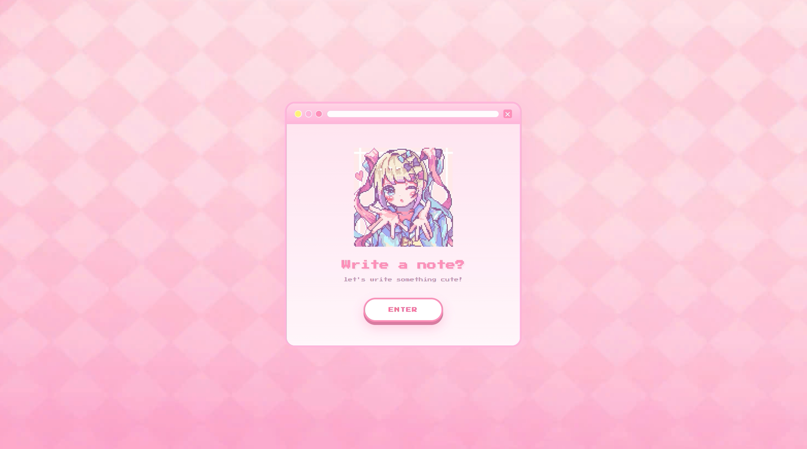
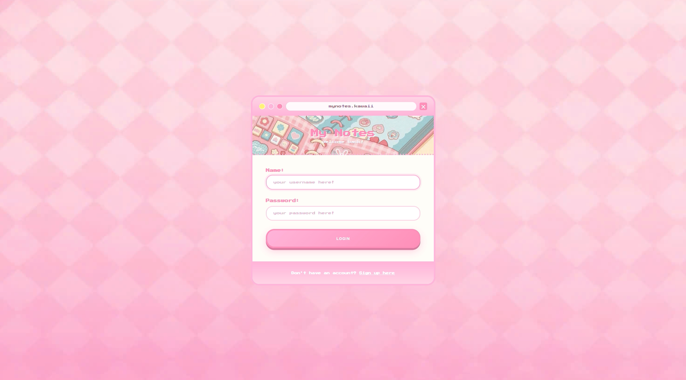
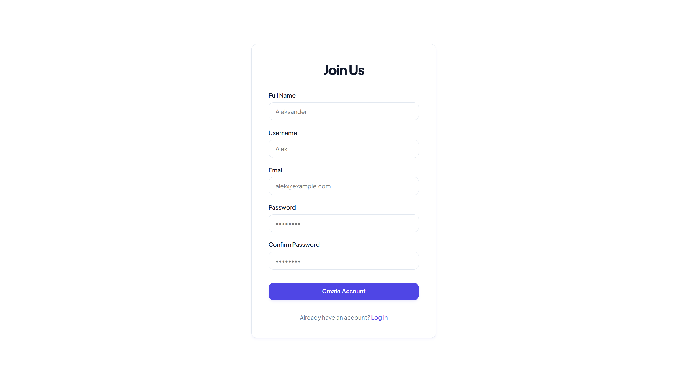
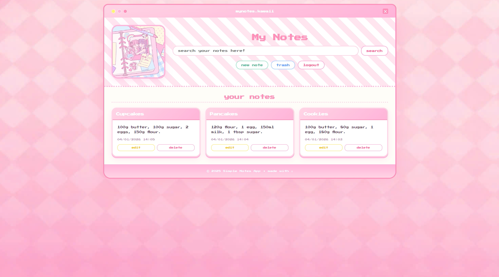
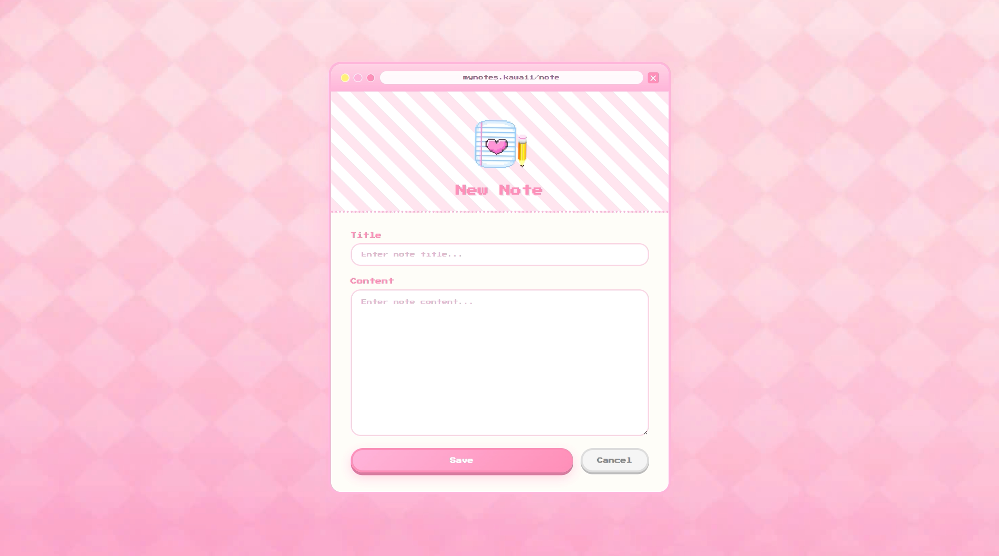
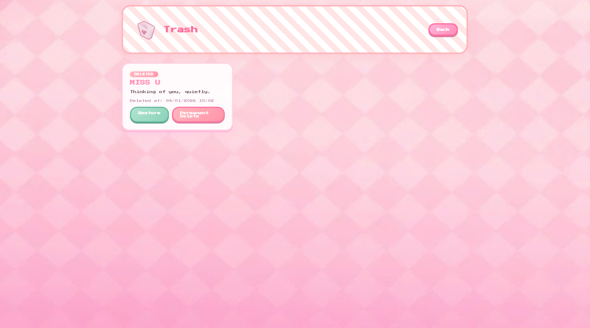

# Take Note
A simple note-taking web application with basic CRUD features.

This is a web application developed while learning Java Servlet and JSP.
The project demonstrates core backend concepts such as MVC architecture, request handling, and data flow, and provides basic CRUD functionalities that allow users to create, view, update, and delete notes.
It also integrates React on the frontend to explore a hybrid approach between a traditional Java backend and a modern UI framework.

